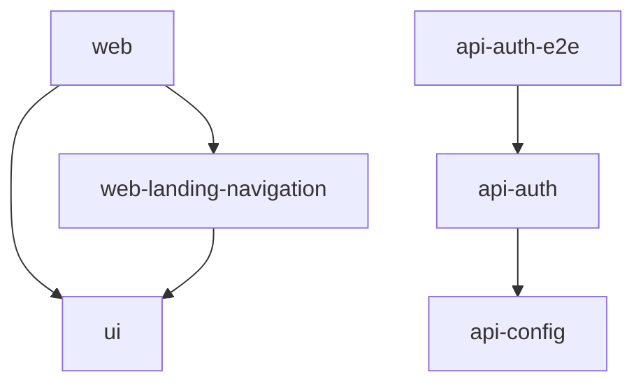

<h1 align="center">Producktivity</h1>

## Project Visualization



## Development

### Web Development

```bash
pnpm nx serve web
```

```bash
pnpm wrangler d1 execute dev-certifine --local --file=db/schema/schema.sql
pnpm nx serve api-auth

VITE_GOOGLE_REDIRECT_URI=http://localhost:8788/api/auth/google/callback pnpm nx build web
pnpm wrangler pages dev dist/apps/web/deploy
```

### UI Development

```bash
pnpm nx storybook ui
```

## References

### Design

- https://m3.material.io/
